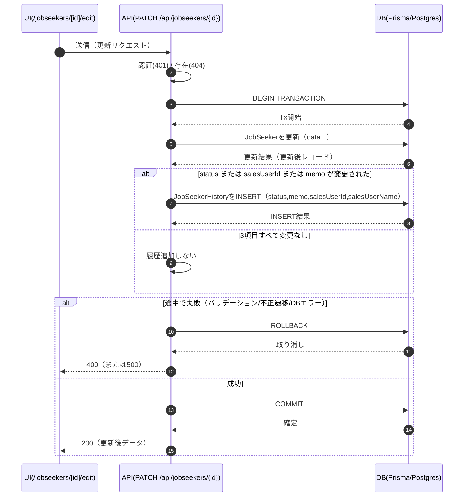

# 求職者編集 詳細設計

（元データ：Excel「求職者編集.xlsx」各シート）

## 00 共通ルール

| カテゴリ | ルール                                                                                                                               |
| :------- | :----------------------------------------------------------------------------------------------------------------------------------- |
| 更新可否 | その画面/機能から当該項目を更新（入力→保存）できるか。APIの更新許可フィールド（allowlist）にも一致させる。値例：可 / 不可 / 条件付き |
| 履歴     | JobSeekerHistory は「担当者、ステータス、メモ変更時のみ」1件追加。status未指定 or 変更なしの場合は追加しない。                       |
| 遷移     | 基本：NEW→INTERVIEWED→PROPOSING→OFFERED→CLOSED。例外：各状態から CLOSED への遷移は可。巻き戻し不可。                                 |
| Tx       | JobSeeker 更新と JobSeekerHistory 追加は同一トランザクションで実行する。                                                             |

### 補足（履歴トリガー）

- 履歴（JobSeekerHistory）は **ステータス変更時のみではなく**、編集画面で **status / salesUserId(担当者) / memo のいずれかが変更された時** に1件追加する。

## 01 画面項目定義（求職者編集）

| 対象（画面） | ルーティング                   | エンティティ | DBカラム/パス   | 項目名（UI）          | データ型 | 必須か（UI） | 必須か（API） | 入力制約（形式/文字数/範囲）             | 初期値/表示  | 更新可否 | 権限方針（MVP） | 履歴方針（いつ）                                             | 例外/エラー     | 備考                             |
| :----------- | :----------------------------- | :----------- | :-------------- | :-------------------- | :------- | :----------- | :------------ | :--------------------------------------- | :----------- | :------- | :-------------- | :----------------------------------------------------------- | :-------------- | :------------------------------- |
| 求職者編集   | /jobseekers/[jobSeekerId]/edit | JobSeeker    | name            | 氏名                  | string   | Yes          | No            | 1〜100文字                               | 既存値       | 可       | 全ユーザー      | 残さない                                                     |                 |                                  |
| 求職者編集   | /jobseekers/[jobSeekerId]/edit | JobSeeker    | age             | 年齢                  | number   | No           | No            | 0〜120の整数                             | 既存値       | 可       | 全ユーザー      | 残さない                                                     |                 |                                  |
| 求職者編集   | /jobseekers/[jobSeekerId]/edit | JobSeeker    | email           | メールアドレス        | string   | Yes          | No            | メール形式、最大255文字                  | 既存値       | 可       | 全ユーザー      | 残さない                                                     |                 |                                  |
| 求職者編集   | /jobseekers/[jobSeekerId]/edit | JobSeeker    | phone           | 電話番号              | string   | Yes          | No            | 数字とハイフンのみ、最大20文字           | 既存値       | 可       | 全ユーザー      | 残さない                                                     |                 |                                  |
| 求職者編集   | /jobseekers/[jobSeekerId]/edit | JobSeeker    | desiredJobType  | 希望職種              | string   | Yes          | No            | 1〜100文字                               | 既存値       | 可       | 全ユーザー      | 残さない                                                     |                 |                                  |
| 求職者編集   | /jobseekers/[jobSeekerId]/edit | JobSeeker    | desiredLocation | 希望勤務地            | string   | Yes          | No            | 1〜100文字                               | 既存値       | 可       | 全ユーザー      | 残さない                                                     |                 |                                  |
| 求職者編集   | /jobseekers/[jobSeekerId]/edit | JobSeeker    | salesUserId     | 担当者（salesUserId） | string   | No           | No            | 営業担当者のプルダウン                   | 既存値       | 可       | 全ユーザー      | 担当者、ステータス、メモ変更時のみ：salesUserId/nameを複製） |                 | 表示は SalesUser.name            |
| 求職者編集   | /jobseekers/[jobSeekerId]/edit | JobSeeker    | status          | ステータス            | enum     | No           | No            | NEW/INTERVIEWED/PROPOSING/OFFERED/CLOSED | 既存値       | 条件付き | 全ユーザー      | 担当者、ステータス、メモ変更時のみ                           | 不正な遷移は400 | 遷移は 05\_ステータス遷移 に従う |
| 求職者編集   | /jobseekers/[jobSeekerId]/edit | JobSeeker    | updatedAt       | 最終更新日            | datetime | No           | No            | 自動設定                                 | 表示（自動） | 可       | 編集不可        | 担当者、ステータス、メモ変更時のみ                           |                 |                                  |
| 求職者編集   | /jobseekers/[jobSeekerId]/edit | JobSeeker    | memo            | メモ                  | string   | No           | No            | 0〜2000文字                              | 既存値       | 可       | 全ユーザー      | 担当者、ステータス、メモ変更時のみ                           |                 |                                  |

## 02 API仕様

| 画面名     | HTTPメソッド | URL                           | 認証 | 権限       | リクエストBody                                                                              | レスポンス              | バリデーション                                         | 副作用                                                                        | Tx             | エラー                                  | 備考                           |
| :--------- | :----------- | :---------------------------- | :--- | :--------- | :------------------------------------------------------------------------------------------ | :---------------------- | :----------------------------------------------------- | :---------------------------------------------------------------------------- | :------------- | :-------------------------------------- | :----------------------------- |
| 求職者編集 | PATCH        | /api/jobseekers/{jobSeekerId} | 要   | 全ユーザー | { name, age?, email, phone, desiredJobType, desiredLocation, salesUserId?, status?, memo? } | { jobSeeker }（更新後） | 01\_画面項目定義の制約に従う。statusは遷移ルール適用。 | JobSeeker更新。Status,memo,salesUserId変更時のみ JobSeekerHistory を1件追加。 | あり（同一Tx） | 401/404/400（バリデーション・不正遷移） |                                |
| 求職者編集 | GET          | /api/jobseekers/{jobSeekerId} | 要   | 全ユーザー | なし                                                                                        | { jobSeeker }           | pathのjobSeekerIdは必須                                | なし                                                                          | なし           | 401/404                                 | 編集画面の初期表示データ取得用 |

## 03 DB定義

| テーブル             | カラム           | 型            | PK  | FK                | NULL     | デフォルト | インデックス | 備考         |
| :------------------- | :--------------- | :------------ | :-- | :---------------- | :------- | :--------- | :----------- | :----------- |
| sales_users          | id               | varchar(50)   | PK  |                   | NOT NULL |            |              | ログインID   |
| sales_users          | name             | varchar(255)  |     |                   | NOT NULL |            |              | 表示名       |
| sales_users          | password         | varchar(255)  |     |                   | NOT NULL |            |              | ハッシュ想定 |
| sales_users          | is_active        | boolean       |     |                   | NOT NULL | true       |              | 有効フラグ   |
| job_seekers          | id               | string(cuid)  | PK  |                   | NOT NULL | cuid()     |              |              |
| job_seekers          | sales_user_id    | varchar(50)   |     | FK:sales_users.id | NOT NULL |            |              | 担当者       |
| job_seekers          | name             | varchar(100)  |     |                   | NOT NULL |            |              |              |
| job_seekers          | age              | int           |     |                   | NULL     |            |              |              |
| job_seekers          | email            | varchar(255)  |     |                   | NOT NULL |            |              |              |
| job_seekers          | phone            | varchar(20)   |     |                   | NOT NULL |            |              |              |
| job_seekers          | desired_job_type | varchar(100)  |     |                   | NOT NULL |            |              |              |
| job_seekers          | desired_location | varchar(100)  |     |                   | NOT NULL |            |              |              |
| job_seekers          | status           | enum          |     |                   | NOT NULL | NEW        |              |              |
| job_seekers          | memo             | varchar(2000) |     |                   | NULL     |            |              |              |
| job_seekers          | created_at       | datetime      |     |                   | NOT NULL | now()      |              |              |
| job_seekers          | updated_at       | datetime      |     |                   | NOT NULL | auto       |              | 自動更新     |
| job_seeker_histories | id               | string(cuid)  | PK  |                   | NOT NULL | cuid()     |              |              |
| job_seeker_histories | job_seeker_id    | string        |     | FK:job_seekers.id | NOT NULL |            |              |              |
| job_seeker_histories | status           | enum          |     |                   | NOT NULL |            |              |              |
| job_seeker_histories | memo             | varchar(2000) |     |                   | NULL     |            |              |              |
| job_seeker_histories | sales_user_id    | varchar(50)   |     |                   | NOT NULL |            |              |              |
| job_seeker_histories | sales_user_name  | varchar(255)  |     |                   | NOT NULL |            |              |              |
| job_seeker_histories | created_at       | datetime      |     |                   | NOT NULL | now()      |              |              |

## 04 履歴仕様

| 対象             | トリガー                                            | 操作   | 保存項目                                                         | 値のソース           | 備考           |
| :--------------- | :-------------------------------------------------- | :----- | :--------------------------------------------------------------- | :------------------- | :------------- |
| JobSeekerHistory | 求職者編集で status,memo,salesUserId が変更された時 | INSERT | jobSeekerId, status, memo, salesUserId, salesUserName, createdAt | session / 変更後の値 | 巻き戻し不可。 |

## 05 ステータス遷移

| エンティティ | 現在        | 次          | 許可 | 画面       | API                        | 備考 |
| :----------- | :---------- | :---------- | :--- | :--------- | :------------------------- | :--- |
| JobSeeker    | NEW         | INTERVIEWED | Yes  | 求職者編集 | PATCH /api/jobseekers/{id} |      |
| JobSeeker    | INTERVIEWED | PROPOSING   | Yes  | 求職者編集 | PATCH /api/jobseekers/{id} |      |
| JobSeeker    | PROPOSING   | OFFERED     | Yes  | 求職者編集 | PATCH /api/jobseekers/{id} |      |
| JobSeeker    | OFFERED     | CLOSED      | Yes  | 求職者編集 | PATCH /api/jobseekers/{id} |      |
| JobSeeker    | NEW         | CLOSED      | Yes  | 求職者編集 | PATCH /api/jobseekers/{id} | 例外 |
| JobSeeker    | INTERVIEWED | CLOSED      | Yes  | 求職者編集 | PATCH /api/jobseekers/{id} | 例外 |
| JobSeeker    | PROPOSING   | CLOSED      | Yes  | 求職者編集 | PATCH /api/jobseekers/{id} | 例外 |

## 06 権限マトリクス

| 機能     | 対象                                | 営業 | 管理者 | 備考                                          |
| :------- | :---------------------------------- | :--- | :----- | :-------------------------------------------- |
| 画面表示 | /jobseekers/[jobSeekerId]/edit      | ○    |        | 未ログインは /login へ                        |
| 更新     | PATCH /api/jobseekers/{jobSeekerId} | ○    |        | アクセス制御はMVPスコープに含まれていないため |

## トランザクション（PATCH /api/jobseekers/{jobSeekerId}）

