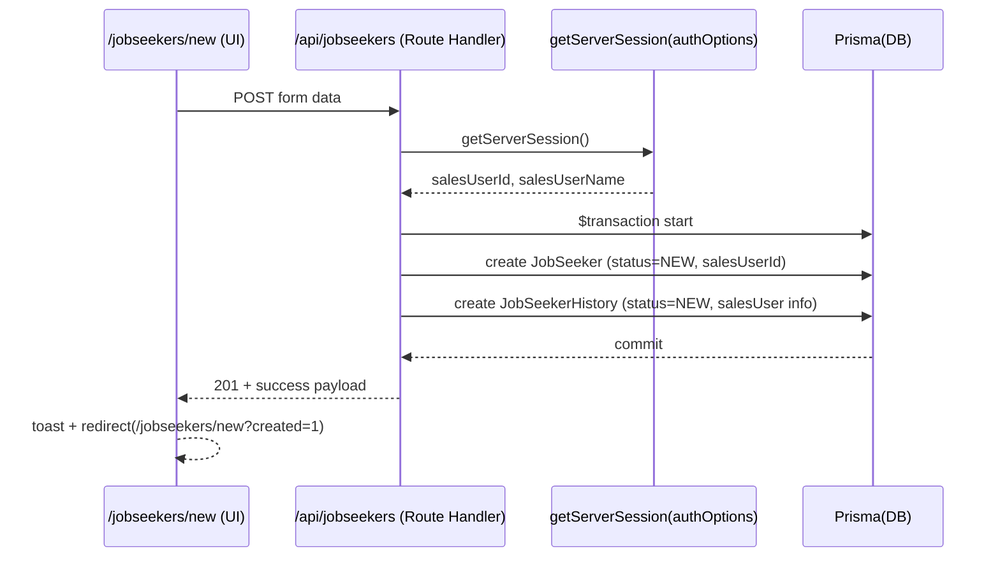

## 画面名：求職者新規作成

### 目的

営業担当者の求職者を新規作成する。

### 対象スキーマ

JobSeeker
SalesUser
JobSeekerHistory

### 表示項目

- 氏名
- 年齢
- メールアドレス
- 電話番号
- 希望職種
- 希望勤務地
- メモ

### 機能

- 表示項目で求職者を新規作成
- ログインしている営業担当者を求職者の担当者としてDBに登録
- ステータスを新規で作成
- 最終更新日と作成日も作成
- バリデーション
- 戻るボタン
- 再送対策
- セッション
- 作成成功時、JobSeekerHistory を同一トランザクションで1件追加する

### 挙動

- 求職者一覧から、求職者新規作成へ遷移
- 作成ボタンを押した後は、作成されたメッセージを表示し、求職者新規作成へリダイレクト
- 戻るボタンで、求職者一覧へ戻る

### ルーティング

求職者一覧 /jobseekers
求職者新規作成 /jobseekers/new

### ルール

| 対象（画面）   | エンティティ | 項目名         | 必須 | 入力制約（文字数・形式など）           |
| -------------- | ------------ | -------------- | ---- | -------------------------------------- |
| 求職者新規作成 | 求職者       | 氏名           | Yes  | 1〜100文字                             |
| 求職者新規作成 | 求職者       | 年齢           | No   | 0〜120の整数                           |
| 求職者新規作成 | 求職者       | メールアドレス | Yes  | メール形式（xxx@yyy.zzz）、最大255文字 |
| 求職者新規作成 | 求職者       | 電話番号       | Yes  | 数字とハイフンのみ、最大20文字         |
| 求職者新規作成 | 求職者       | 希望職種       | Yes  | 1〜100文字                             |
| 求職者新規作成 | 求職者       | 希望勤務地     | Yes  | 1〜100文字                             |
| 求職者新規作成 | 求職者       | メモ           | No   | 0〜2000文字                            |

### スキーマ

```
model SalesUser {
  // ✅ ログインID（1〜50文字、英数字と - _ のみ）を“手入力で”使う想定
  // cuid() や autoincrement() は使わない
  id       String   @id @db.VarChar(50)
  name     String   @db.VarChar(255)
  password String   @db.VarChar(255)
  isActive Boolean  @default(true)

  jobSeekers JobSeeker[]

  @@map("sales_users")
}

model JobSeeker {
  id              String          @id @default(cuid())
  salesUserId     String          @db.VarChar(50)

  name            String          @db.VarChar(100)  // 1〜100文字（必須）
  age             Int?                               // 0〜120（アプリ側でバリデーション）
  email           String          @db.VarChar(255)  // ✅ 必須
  phone           String          @db.VarChar(20)   // ✅ 必須（数字とハイフン、最大20）

  desiredJobType  String          @db.VarChar(100)  // ✅ 希望職種（必須・1〜100）
  desiredLocation String          @db.VarChar(100)  // ✅ 希望勤務地（必須・1〜100）

  desiredSalary   Int?

  status          JobSeekerStatus @default(NEW)

  memo            String?         @db.VarChar(2000) // 0〜2000文字
  createdAt       DateTime        @default(now())
  updatedAt       DateTime        @updatedAt

  salesUser       SalesUser       @relation(fields: [salesUserId], references: [id])
  histories       JobSeekerHistory[]

  @@index([salesUserId])
  @@map("job_seekers")
}

model JobSeekerHistory {
  id            String          @id @default(cuid())
  jobSeekerId   String

  status        JobSeekerStatus
  memo          String?         @db.VarChar(2000)

  salesUserId   String          @db.VarChar(50)
  salesUserName String          @db.VarChar(255)

  createdAt     DateTime        @default(now())

  jobSeeker     JobSeeker       @relation(fields: [jobSeekerId], references: [id])

  @@index([jobSeekerId, createdAt])
  @@map("job_seeker_histories")
}
```

### トランザクション



### API

| 画面名         | ユーザー操作   | 認証 | httpメソッド | url             | 例  |
| -------------- | -------------- | ---- | ------------ | --------------- | --- |
| 求職者新規作成 | 新規作成したい | 要   | POST         | /api/jobseekers |

### セッション

| キー          | 型     | 例          | 用途           | ソース         |
| ------------- | ------ | ----------- | -------------- | -------------- |
| salesUserId   | string | "sales-001" | DBの担当者確定 | SalesUser.id   |
| salesUserName | string | "営業 太郎" | 表示/履歴複製  | SalesUser.name |

### 前提

Next.js(App Router) + Auth.js v4
Next APIを使う
tailwind/shadcnを使う
最小構成
lib/prisma.ts
lib/auth.ts
validation設定例：features/auth/loginSchema.test.ts
